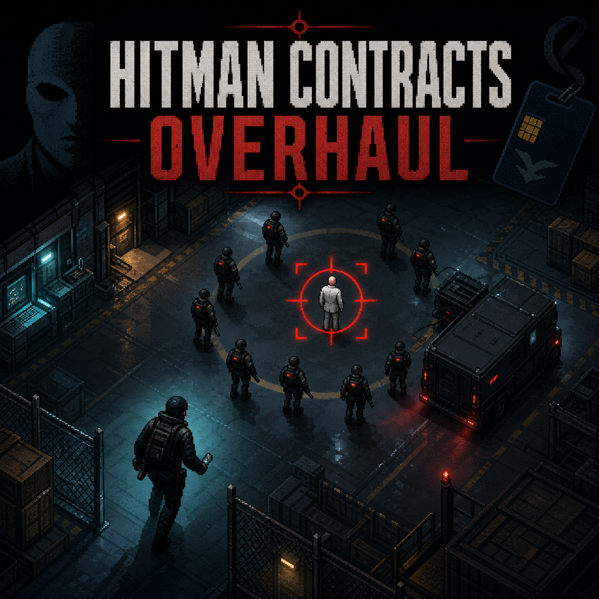

# Hitman Contracts Overhaul



Hitman Contracts Overhaul (HCO) turns compatible Intravenous 2 missions into systemic high-value-target operations. It adds optional native objectives, mobile targets, escalating protection details, field intelligence, disguises, credentials, social stealth, evidence-driven searches, physical drones, and campaign rewards without placing a separate menu over the game.

**Current build:** `0.10.0-rc12`
**Target game:** Intravenous 2 `1.4.12HF3`  
**Status:** public release candidate; boot and automated subsystem checks pass, while RC12's native-camera drone carrier, target evacuation, and split protection response require final in-game validation.

## Highlights

- One to three deterministic optional contracts per compatible mission.
- Executive, Broker, Fixer, and Commander archetypes with distinct appearance, rewards, drone doctrines, five close bodyguards, and 5/10/15/20 separate response units, constrained by the map's safe NPC population.
- Stronger protected targets and elite guards with archetype-scaled health.
- Mobile target phases, safe-area relocation, physical evacuation, and anti-stuck recovery without teleporting targets.
- Field-intelligence dead drops that reveal exact moving target markers.
- Body-search disguises, plausible weapons, restricted areas, credentials, colleague recognition, compromise, and interruptible radio checks.
- Physical, animated, destructible search drones with scan cones, rotor audio, search sectors, and coordinated pressure responses.
- One to three archetype-scaled drones patrol around each protected target from contract start, then switch to a faster and more exact aggressive search after escalation.
- Immediate protection mobilization and drone request on confirmed contact, guard damage, or protection casualties.
- Three loud player shots within eight seconds trigger aggressive drone support independently of visual-contact hand-off; NPC fire and suppressed player fire do not.
- Engine-owned security-camera carriers avoid fragile late class registration; the native camera body remains visible even if the custom drone sprite cannot load.
- Confirmed contact sends the target and its five close guards toward safety while response units hunt the player instead of dragging the principal into combat.
- Native contract-completion banner, audio feedback, campaign payout, and save/reload persistence.
- Transactional activation, duplicate-copy protection, and isolated subsystem failure handling.

## How it plays

No menu or hotkey is required. Start a compatible mission from the beginning. HCO selects safe mission actors and adds optional contracts through the native objective system. Follow the intelligence marker, recover the dead drop, and then track the moving target.

Approach a dead or unconscious guard and choose **Search body / take disguise**. Normal movement and plausible equipment reduce suspicion; running, aiming, firing, lockpicking, carrying a body, restricted access, or close colleagues can expose you.

If security confirms you, takes fire, or loses a protection member, the detail enters combat, shares the last known position, and requests its archetype's drone response.

## Cheat Trainer compatibility

The companion Intravenous 2 Cheat Trainer recognizes HCO security. HCO targets and guards remain able to detect the player even if ordinary enemy visual detection is disabled. God mode still prevents damage, while damage multipliers and one-hit mode still make HCO targets easy to kill. For a meaningful balance test, use **Reset all cheats** first.

## Installation

1. Download the latest pre-release archive.
2. Create `<Intravenous 2>/mods/Hitman-Contracts-Overhaul`.
3. Extract the archive so the final path is `<Intravenous 2>/mods/Hitman-Contracts-Overhaul/files/main.lua`.
4. Restart the game completely and begin a compatible mission from its start.

Do not enable both a local and Workshop copy at the same time.

## Repository layout

- `files/` — complete installable mod payload.
- `docs/SPECIFICATION.md` — full product and systems specification.
- `docs/ENGINE_EVIDENCE.md` — documented native interface research; no decompiled source is redistributed.
- `docs/TESTING.md` — reproducible automated and in-game acceptance boundary.
- `workshop/` — Steam Workshop copy and preview; excluded from release ZIPs.
- `scripts/` — verification and packaging helpers.

## Build a release archive

```powershell
./scripts/package.ps1
```

## Contributing and license

See [CONTRIBUTING.md](CONTRIBUTING.md). Code is under the [MIT License](LICENSE). Original runtime media is dedicated under [CC0](ASSET_LICENSE.md). Game imagery and trademarks are excluded; see [THIRD_PARTY_NOTICE.md](THIRD_PARTY_NOTICE.md).
